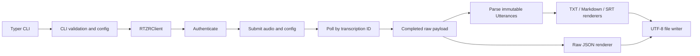

# Architecture

`vito-transcript-cli` separates command presentation, RTZR API communication,
response validation, and file rendering. Each layer has a narrow responsibility,
which keeps API behavior testable without credentials or network access and
keeps output formats independent of HTTP details.

## End-to-end flow



In plain terms, the CLI validates local input before constructing a client. The
client authenticates, uploads the file, and polls the returned job ID. A completed
payload is either parsed into immutable utterances for human-readable formats or
passed directly to the JSON renderer. Rendering produces strings, and a separate
file-writing helper persists those strings as UTF-8.

## CLI boundary

`src/vito_transcript/cli.py` owns Typer-specific presentation and orchestration.
It accepts the audio path and options, prints only high-level progress, invokes
the client once, selects the requested renderers, writes generated files, and
prints their paths. It catches the common `RTZRError` base class so expected
runtime failures become concise stderr messages and exit code 1 rather than
tracebacks.

The CLI does not implement HTTP, polling, response parsing, or output formatting.
It also does not print job IDs, credentials, tokens, request headers, or raw API
responses.

## Deterministic validation and configuration

`src/vito_transcript/cli_config.py` contains fixed string enums for output format,
model, and domain. It validates supported file extensions, regular-file input,
positive finite polling values, Sommers languages, diarization rules, and speaker
count before any API request.

The same module builds the RTZR configuration dictionary from explicit CLI
options. There is no arbitrary JSON configuration input. Repeatable keywords are
converted to a list, and the nested `diarization.spk_count` field is included only
when diarization is enabled and a speaker count was supplied.

## RTZRClient responsibilities

`src/vito_transcript/client.py` owns the RTZR file API lifecycle:

- create or accept a `requests.Session`;
- load credentials through `from_env()` or accept them explicitly;
- authenticate and retain the access token in memory;
- submit multipart audio and serialized JSON configuration;
- fetch the current transcription response;
- poll until `completed`, `failed`, or timed out;
- close internally owned HTTP resources.

The convenience `transcribe()` method combines submission and polling. The CLI
passes `poll_interval` and `timeout` to this method and does not duplicate the
polling loop.

## Authentication and Bearer-token handling

Authentication is sent as `application/x-www-form-urlencoded` to
`/v1/authenticate`. The returned `access_token` must be a non-empty string and is
stored only in client memory. Authentication requests do not carry an
Authorization header.

Submission and result requests obtain a token lazily when one is not already
available, then send it in an `Authorization: Bearer ...` header. Tokens and
credentials are not persisted to files or inserted into client exception
messages. Known sensitive values are redacted from the limited diagnostics
included when RTZR reports a failed transcription.

## Transcription submission

The client checks that the audio path is an existing regular file, opens it with
a context manager, and posts it to `/v1/transcribe` as multipart form data. The
`config` form field is serialized with `json.dumps(..., ensure_ascii=False)`, so
Korean and other Unicode configuration text is not escaped unnecessarily. Every
request receives explicit connect and read timeouts.

The submission response must contain a non-empty string `id`. Extension
validation remains a CLI concern; the reusable API client accepts any regular
file path.

## Polling and monotonic timeout

The client requests `/v1/transcribe/{transcribe_id}` repeatedly. The recognized
states are `transcribing`, `completed`, and `failed`. `completed` returns the full
payload, `failed` raises `RTZRTranscriptionFailedError`, and an unknown or missing
status raises `RTZRResponseError`.

The overall deadline uses `time.monotonic()` rather than wall-clock time, so a
system clock adjustment cannot extend or shorten the configured wait. Polling
defaults to every 5 seconds with a 1,800-second overall timeout.

## Response parsing and immutable utterances

`src/vito_transcript/models.py` validates `results.utterances` and converts each
item to a frozen, slotted `Utterance`. It retains start time, duration, message,
optional speaker, and optional language. The derived `end_at` property supports
subtitle timing.

Malformed utterances are never silently skipped. Parser exceptions identify the
utterance index without embedding the complete response. Boolean values are
rejected for integer fields even though Python treats `bool` as an `int` subtype.

## Exporter separation

The exporter modules are pure renderers:

- `text_exporter.py` renders message-only text;
- `markdown_exporter.py` renders millisecond timestamps and speaker labels;
- `srt_exporter.py` renders SubRip sequence and timing blocks;
- `json_exporter.py` serializes the complete raw completed payload.

TXT, Markdown, and SRT consume parsed `Utterance` objects. JSON intentionally
bypasses those models so it preserves every field returned by the API. Timestamp
helpers use deterministic integer arithmetic and do not wrap after 24 hours.

## UTF-8 file output

Rendering functions do not touch the file system. `write_text_file()` creates
parent directories, writes with UTF-8 encoding, and returns the output path. File
system failures become `RTZROutputError`. The CLI derives filenames from the input
stem and guards against overwriting the source audio path.

## Exception hierarchy

All expected project failures derive from `RTZRError`:

```text
RTZRError
├── RTZRConfigurationError
├── RTZRRequestError
│   └── RTZRAuthenticationError
├── RTZRResponseError
├── RTZRTranscriptionFailedError
├── RTZRTimeoutError
└── RTZROutputError
```

Configuration, request, response-format, terminal transcription, timeout, and
output errors remain distinct while sharing one CLI boundary. Exception messages
avoid credentials, tokens, request headers, and complete raw responses.

## Test seams

The client accepts a Session-compatible object. Tests inject mocked sessions and
responses to assert request bodies, headers, timeouts, response closing, and error
translation without contacting RTZR. Injected sessions remain caller-owned;
internally created sessions are closed by the client context manager.

Polling tests patch `time.monotonic()` and `time.sleep()` directly for deterministic
behavior without a clock abstraction. CLI tests replace `RTZRClient` with a
context-manager mock and use temporary audio and output paths. Exporter and model
tests operate entirely on in-memory payloads.

## Why the layers are separate

API logic changes for authentication or RTZR response handling should not require
changes to CLI presentation or file formats. A new output format should not need
HTTP knowledge, and command validation should not be embedded in a reusable API
client. These boundaries keep security-sensitive request logic focused, make
renderers easy to test as pure functions, and allow the CLI to remain a small
orchestration layer.
